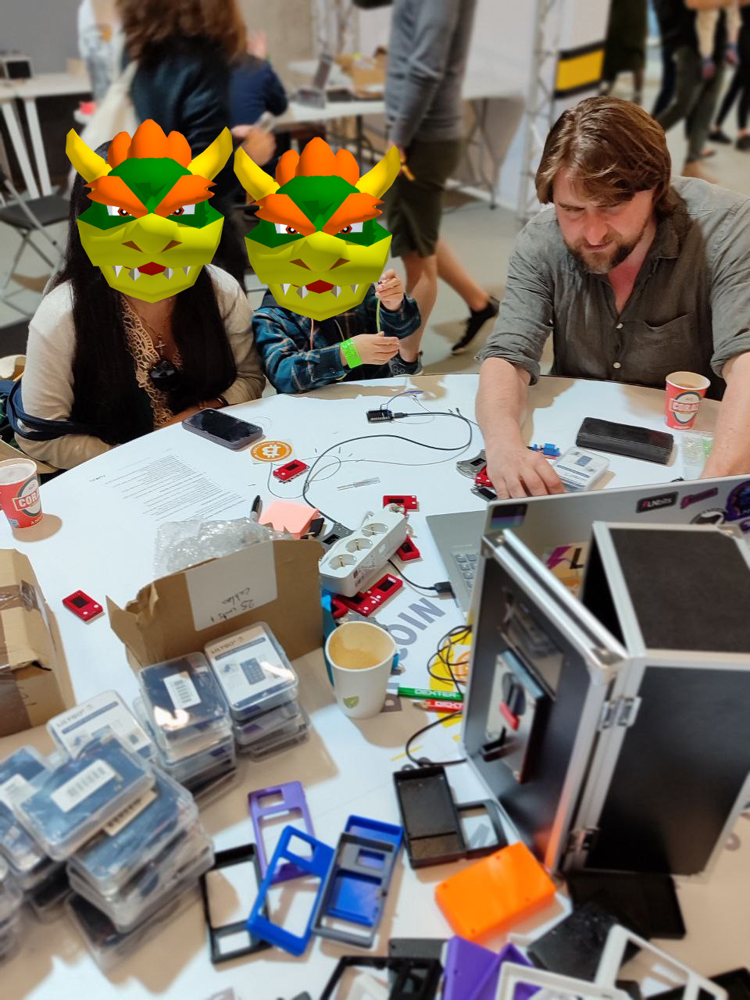
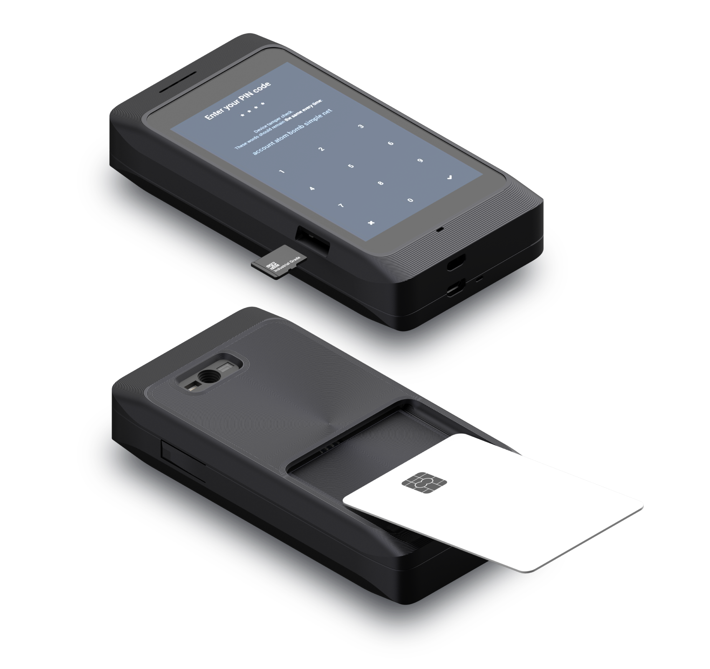
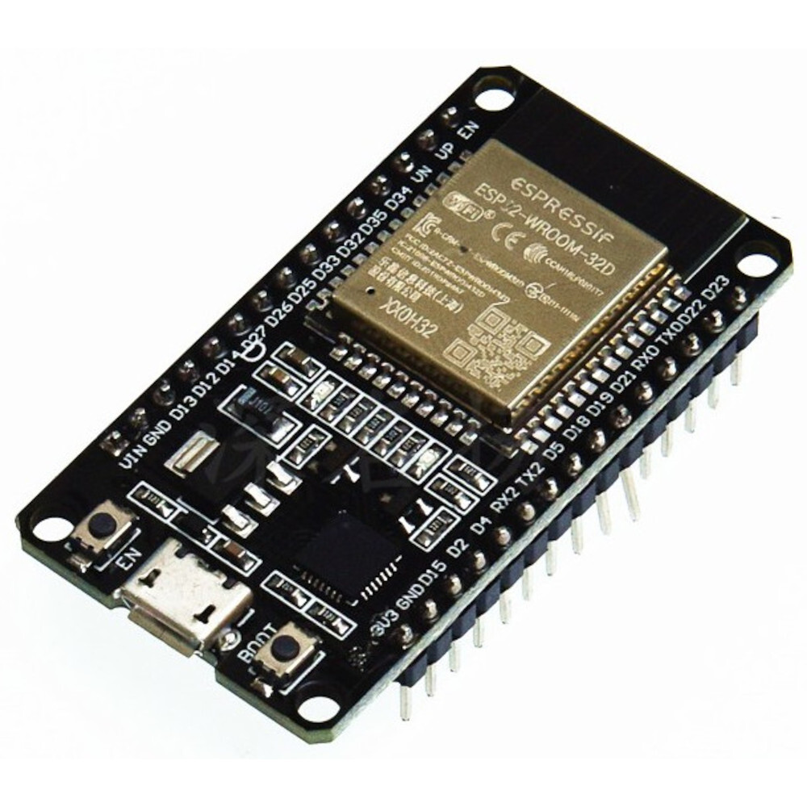
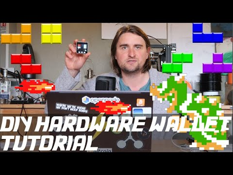
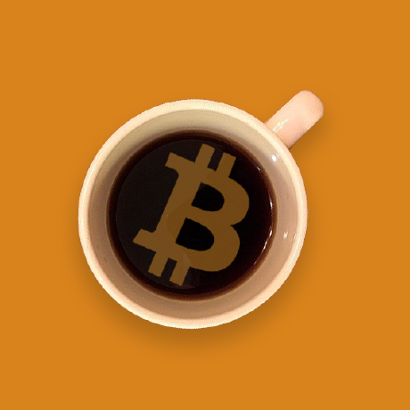
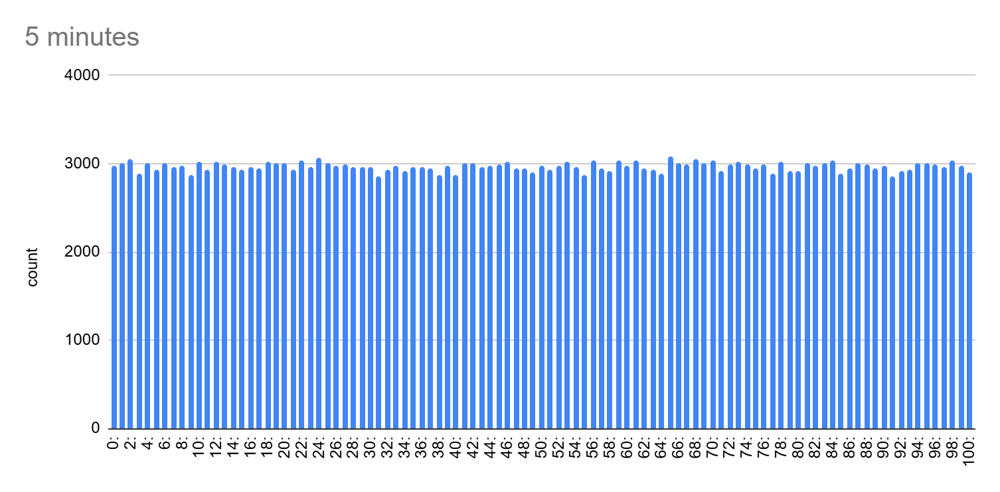
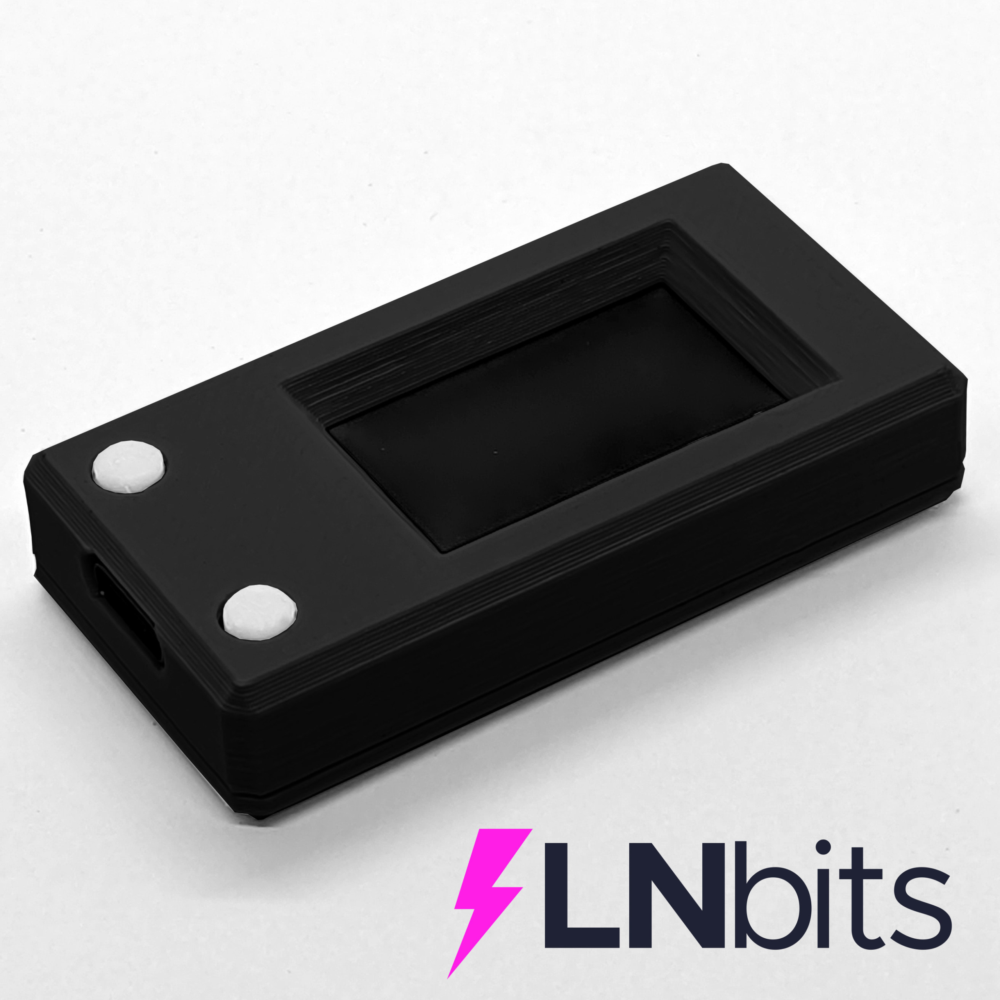
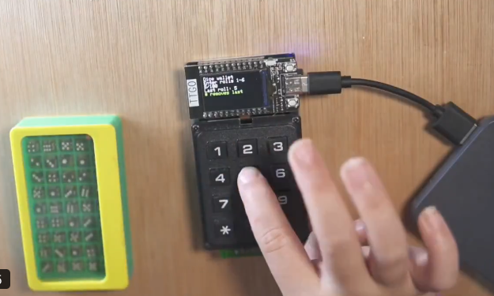
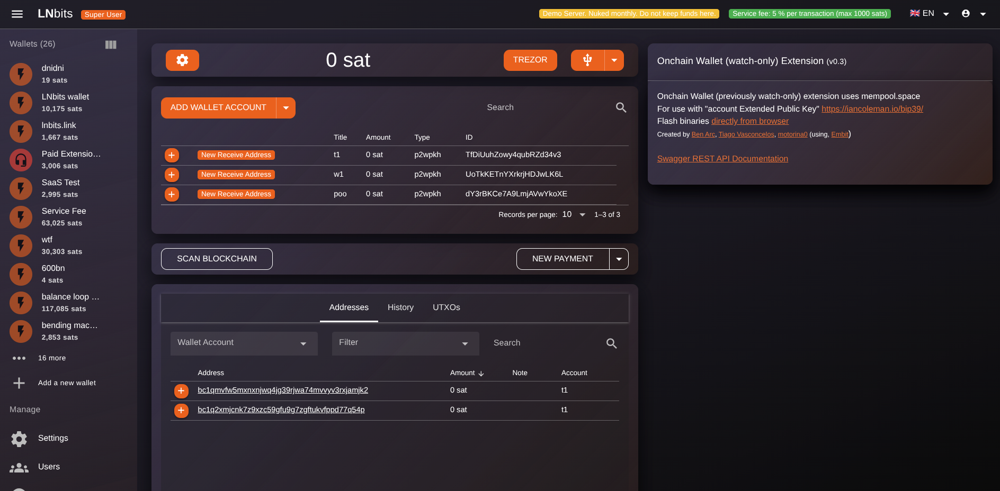
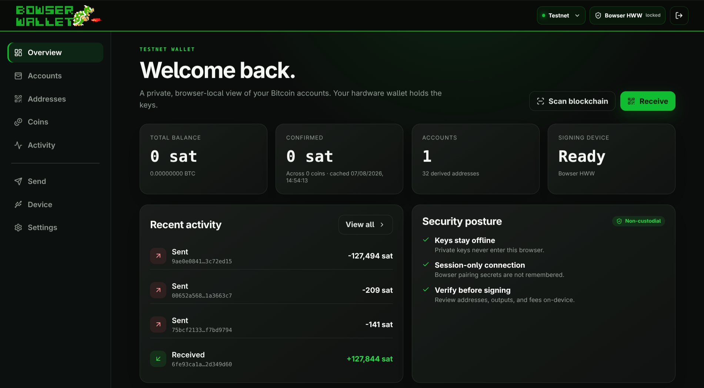

## 2019 // GENESIS

# FROM HACKSPACE TO HARDWARE WALLET (2019)

Stephen Snigirev + uBitcoin + ESP32 + adhoc hackspace at BTCConf.

<!--
Back in 2019 Stephan Snigirev, a quantum physicist, had built the great uBitcoin library for Specter Wallet.

I was there retro-fitting arcade machines to accept Bitcoin payments in what later became the BitcoinSwitch project.

We put some tables together and started what became a tradition of hackspaces at Bitcoin conferences.

We realised we could use uBitcoin and the ESP32's excellent TRNG to make very affordable hardware wallets for only a few dollars.

That was great for unbanked regions, great because the hardware could be sourced independently rather than relying on a hardware-wallet supply chain, and great as an educational tool.

We also committed ourselves to nurturing a maker scene and encouraging Bitcoiners to build their own hardware, which was a great success.
-->

---

## 2020 // OPEN HARDWARE

# THE BOWSER WALLET WAS BORN (2020)

Completely FLOSS. Beta & educational to community FLOSS hardware wallet.

<!--
A year later I made Bowser Wallet as a beta and as a fun educational tool.

Through Bowser Wallet I met Vlad Stan, who helped make a client for it.

Vlad is a bitcoinjs maintainer and now works on LNbits.

When Vlad became full-time on LNbits, and being a genius, he rebuilt Bowser into a fantastic hardware wallet.

The name was bad though. We just called it "Hardware Wallet", intending it to be generic enough that people could fork it and use it as a base.

Through hundreds of workshops, people from the LNbits community including BlackCoffee and Yvette taught many people about DIY hardware wallets.

More recently the Coldcard debacle made me realise I needed to give the project more exposure, so I changed the name back to Bowser and started making this tutorial.

Snigirev stepped back from the Bitcoin space, which is a real shame, and went back to building quantum computers.

We stand on the shoulders of giants.

The Bowser Wallet intentionally uses simple and generic hardware that you can source almost anywhere.

You can buy it from our shop, but please don't. Buy it from AliExpress or Amazon.

The security model of Bowser is your keys being kept on a very simple FLOSS stack.

It has no secure element, so physically secure the device. Keep it locked away in a safe with the gold bars.

Secure elements have always been lower on the list in my own security model because I keep my hardware wallets extremely physically secure.
-->

---

## HARDWARE STACK

# ESP32. SIMPLE HARDWARE EXCELLENT ENTROPY.

### ESP32 TRNG

- Excellent hardware TRNG
- Entropy gathered from physical component noise
- Massively deployed in IoT hardware
- Cheap and widely available

### TOUGH/RESILIENT

- ESP32 devices are incredibly durable
- Used for long-running remote sensor projects
- Researchers leave them beside glaciers for years
- Off-the-shelf and easy to source hardware

<!--
ESP32s have an excellent TRNG which gathers entropy from physical component noise in the microcontroller.

That is one reason ESP32s are such a common choice for IoT devices.

They are also incredibly tough.

Researchers leave these kinds of devices beside glaciers for years at a time gathering readings.

For Bowser that combination is ideal: cheap, replaceable, widely available hardware with a hardware entropy source.
-->

---

## BOWSER WALLET // TWO MODES SAME HARDWARE

# CONNECTED OR AIR-GAPPED

## USB / WEBSERIAL

- Connects via USB to the computer
- Fine for smaller amounts — up to **$10,000s**
- Easy-to-audit code
- **TRNG:** ESP32 hardware randomness
- **TRNG:** lots of physical entropy inputs

## SD CARD

- Commands passed via simple `.txt` files
- Air-gapped
- Minimal attack vector
- **Dice:** infinitely easy to audit
- **Dice:** fewer steps **SHA256**

<!--
Bowser can be used in two main ways.

In WebSerial mode, you connect the wallet directly over USB.

This is convenient and, for me, perfectly reasonable for smaller amounts — up into the tens of thousands of dollars depending on your threat model.

The ESP32 TRNG is one of the world's most widely deployed and tested hardware random-number generators.

More importantly, the implementation is transparent and the code involved is easy to find and inspect.

It also has lots of physical entropy inputs.

For higher security, Bowser can operate using an SD card.

Commands are passed as simple text files, keeping the signing device air-gapped and the attack surface extremely small.

You can also generate entropy using dice.

Dice are almost absurdly easy to audit because you can physically see where the randomness is coming from.

The critical implementation then only needs to call a handful of well-understood functions such as SHA-256 and the required Bitcoin primitives.
-->

---

## WATCH-ONLY CLIENTS

# SIMPLE CLIENTS

## LNBITS EXTENSION

## BOWSER STANDALONE CLIENT

<!--
The Bowser itself does not need to become a complicated wallet application.

It can remain a very simple signing device while a watch-only client handles balances, addresses, transaction construction and blockchain access.

There is an LNbits extension for people already using the LNbits ecosystem.

There is also a standalone Bowser client which runs as a browser-local watch-only wallet.

The important separation is that the private keys stay on the Bowser hardware.
-->

---

<!-- _class: final -->
<!-- _paginate: false -->

## > BOWSER WALLET

# LET'S BUILD

<!--
Let's build one!
-->
